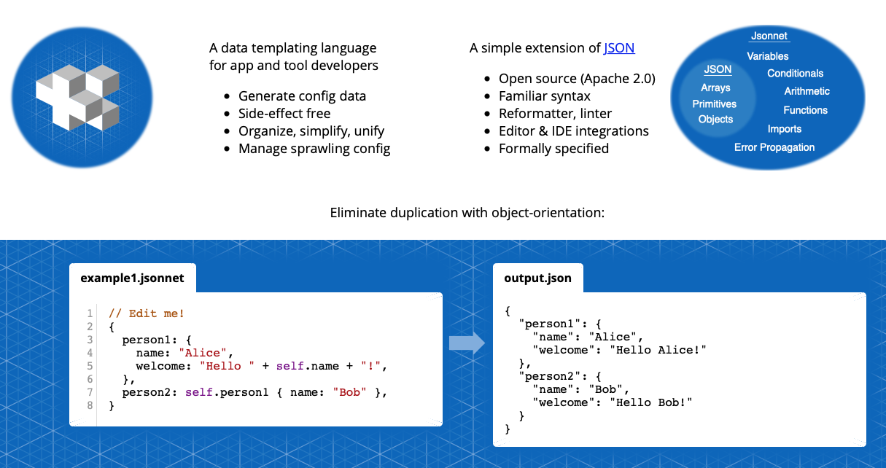

= Jsonnet: Data driven configuration language

== Talk Outline
* Jsonnet overview
* Advantage of string templating
* Simple example

== Useful Links
* https://twitter.com/olliehughes82[@olliehughes82]
* https://github.com/databricks/jsonnet-style-guide[Databricks Jsonnet Style Guide]
* https://github.com/grafana/jsonnet-libs[Grafana Jsonnet tools and mixins]

== Tools
* [Jsonnet]
* [Jsonnet Bundler]
* [yq]

== Jsonnet Overview

* Superset of JSON - cloud resources
* Reuse
* Icky
* Merge
* Transform
* Function
* Conditionals
* Std lib

Superset of JSON designed for describing cloud resources

== Pros & Cons
✅ Data is smart, text is dumb

✅ Reuse curated "data models"

✅ More machine readable / writable than YAML (because it's data not text)

✅ Excellent at merging or overriding deeply nested data structures

✅ Create "native" functions easily in Go

✅ JVM bindings (integrate with your build easily)

🛑 Can be a hard sell to colleagues

🛑 It has Json in the name

🛑 Looks a bit like the spawn of JSON & Python

🛑 To quote my colleague "Ugh... It's Icky"

== Alternative approaches
* Plain old, duplicated, hand cranked YAML
* Kustomize

== Simple example

Sharing configuration::
* Link to github on how to install tools and follow steps
* Create file `common-data.jsonnet.TEMPLATE`
* Implement simple JSON structure with hardcoded data

[source]
.build-meta.json
----
{
  "projectName": "spring-microservice"
  "appMeta": {
    "buildInfo": {
      "commitSha": "f6b4cd",
      "prefix": "SNAPSHOT",
      "releaseNumber": "SNAPSHOT-f6b4cd"
    },
    "versionInfo": {
      "humanized": "1.3.2-SNAPSHOT-f6b4cd",
      "major": 1,
      "minor": 3,
      "patch": 2
    },
    "artifacts": [
      "spring-microservice-1.3.2-SNAPSHOT-f6b4cd.src.jar",
      "spring-microservice-1.3.2-SNAPSHOT-f6b4cd.javadoc.jar",
      "spring-microservice-1.3.2-SNAPSHOT-f6b4cd.bin.jar",
      "spring-microservice-1.3.2-SNAPSHOT-f6b4cd.tar.gz"
    ],
  }
}
----

* Parameterize `projectName`
* Parameterize `commitSha` using a simple variable reference
* Reference `buildInfo` properties from `versionInfo.humanize`
* Parameterize `prefix` showing merge behaviour - it will fail
  if we don't provide `releaseNumber` which isn't desired.
* Show how using `+::`
